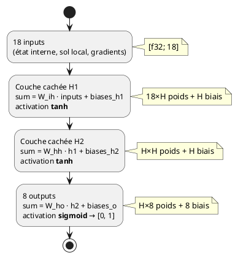

# Réseau de Neurones

## Architecture : 18 → H → H → 8

Topologie à 2 couches cachées de taille variable. La taille des couches cachées (`hidden_size`) est un **trait génétique** (6-14 neurones), mutable par mutation (±1). Seuls les cerveaux de même `hidden_size` peuvent se croiser, ce qui pousse vers la spéciation naturelle.

## Couche d'entrée — 18 neurones

**État interne (4 inputs) :**

| Input | Plage | Description |
|---|---|---|
| vitality | [0, 1] | PV / 100 |
| energy | [0, 1] | Énergie / 100 |
| biomass_ratio | [0, 1] | nb_cellules / maxSize (marge de croissance restante) |
| age_ratio | [0, 1] | ticks vécus / durée max estimée |

**Sol local (4 inputs) :**

| Input | Plage | Description |
|---|---|---|
| carbon_here | [0, 1] | Moyenne du carbone sous la zone de place |
| nitrogen_here | [0, 1] | Moyenne de l'azote sous la zone de place |
| humidity_here | [0, 1] | Moyenne de l'humidité sous la zone de place |
| light_here | [0, 1] | Lumière reçue (réduite si ombragée par canopée) |

**Gradients environnementaux (10 inputs) :**

Calculés sur la zone d'influence (rayon scale avec la biomasse, voir 03-perception.md).

| Input | Plage | Description |
|---|---|---|
| carbon_grad_x | [-1, 1] | Direction X vers le sol le plus riche en carbone |
| carbon_grad_y | [-1, 1] | Direction Y |
| nitrogen_grad_x | [-1, 1] | Direction X vers le sol le plus riche en azote |
| nitrogen_grad_y | [-1, 1] | Direction Y |
| humidity_grad_x | [-1, 1] | Direction X vers les zones les plus humides |
| humidity_grad_y | [-1, 1] | Direction Y |
| biomass_grad_x | [-1, 1] | Direction X vers la plus forte densité de végétation |
| biomass_grad_y | [-1, 1] | Direction Y |
| light_grad_x | [-1, 1] | Direction X vers les zones les plus éclairées |
| light_grad_y | [-1, 1] | Direction Y |

## Couches cachées

**2 couches de `hidden_size` neurones** (6-14). Activation : `tanh`. Seuls les poids évoluent (topologie fixe hors mutation de taille).

**Nombre total de paramètres** = `18×H + H×H + H×8 + H + H + 8` (poids + biais).

| H | Poids (18H + H² + 8H) | Biais (H + H + 8) | **Total** |
|---|---|---|---|
| 6 | 204 | 20 | **212** |
| 8 | 272 | 24 | **296** |
| 10 | 360 | 28 | **388** |
| 14 | 560 | 36 | **596** |

Taille mémoire : de 212 paramètres (H=6, ~0.8 Ko) à 596 paramètres (H=14, ~2.3 Ko) par cerveau.

## Couche de sortie — 8 neurones

| Output | Index | Activation | Description |
|---|---|---|---|
| grow_intensity | 0 | sigmoid → [0, 1] | Part d'énergie allouée à la croissance (0 = maintenance, 1 = croissance max) |
| grow_dir_x | 1 | sigmoid → [0, 1] (remap [-1, 1]) | Direction X privilégiée pour la croissance. Remap : `output * 2.0 - 1.0`. |
| grow_dir_y | 2 | sigmoid → [0, 1] (remap [-1, 1]) | Direction Y privilégiée. Remap : `output * 2.0 - 1.0`. |
| canopy_vs_roots | 3 | sigmoid → [0, 1] | 3 voies : canopée (> 0.66, couche aérienne + photosynthèse), emprise au sol (0.33 – 0.66, exclusive, invasion possible), racines (< 0.33, souterrain, chimiotaxie, gratuit) |
| exudate_rate | 4 | sigmoid → [0, 1] | Volume d'exsudats injectés dans le sol. Le type exsudé (carbone ou azote) est un trait génétique, pas une décision. |
| defense | 5 | sigmoid → [0, 1] | Durcir les racines (> 0.5). Augmente le seuil d'invasion de +10 à +20 énergie. Coûte 3 énergie/tick. |
| connect_signal | 6 | sigmoid → [0, 1] | Accepter une connexion mycorhizienne directe (> 0.5 = oui) |
| connect_generosity | 7 | sigmoid → [0, 1] | Volume de l'échange C↔N + énergie via le lien direct. Chaque plante donne son surplus proportionnellement à ce curseur. 0 = parasitisme (reçoit sans donner). |

## Forward pass — diagramme



## Traits génétiques liés au cerveau

| Trait | Plage | Mutation | Description |
|---|---|---|---|
| hidden_size | 6 – 14 | ±1 | Neurones par couche cachée. Contraint le crossover (même taille requise). |
| exudate_type | carbone \| azote | flip rare | Ce que la plante exsude. Les fixatrices d'azote émergent par évolution. |
| carbon_nitrogen_ratio | 0.3 – 0.9 | gaussien | Ratio de consommation C/N pour la croissance. |
| maxSize | 15 – 40 | gaussien | Taille max de la plante. |

## Propagation

Le forward pass est un simple produit matrice-vecteur par couche, suivi de l'activation. Implémenté en Rust pur avec des vecteurs plats (`Vec<f32>`) pour chaque couche :

```rust
struct Brain {
    hidden_size: u8,
    weights_ih: Vec<f32>,  // INPUT_SIZE × hidden_size
    weights_hh: Vec<f32>,  // hidden_size × hidden_size
    weights_ho: Vec<f32>,  // hidden_size × OUTPUT_SIZE
    biases_h1: Vec<f32>,   // hidden_size
    biases_h2: Vec<f32>,   // hidden_size
    biases_o: Vec<f32>,    // OUTPUT_SIZE
}

fn forward(&self, inputs: &[f32; 18]) -> [f32; 8]
```

## Crossover et spéciation

Le crossover intervient quand la **banque de graines** injecte une nouvelle graine (voir 06-evolution.md). La banque peut croiser deux génomes pour produire une graine.

- **Crossover** : uniforme sur les poids. Requiert `hidden_size` identique entre les deux parents.
- **Si tailles différentes** : reproduction asexuée (clone d'un parent + mutations).
- **Reproduction vivante** (plante → graine directe) : pas de crossover, clone du parent + mutations.
- **Conséquence** : des clusters d'espèces émergent naturellement autour de chaque `hidden_size`. Les espèces "simples" (H=6-8) convergent vite, les espèces "complexes" (H=12-14) développent des stratégies plus fines mais mettent plus de générations à émerger.

## Compteur de génération

Le numéro de génération est un **index global** qui s'incrémente de 1 à chaque graine plantée (reproduction vivante ou injection depuis la banque). C'est une mesure du temps évolutif, pas un cycle artificiel.
