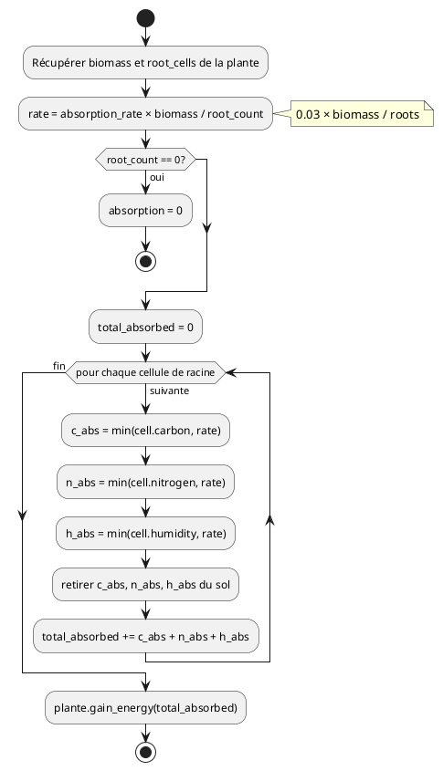
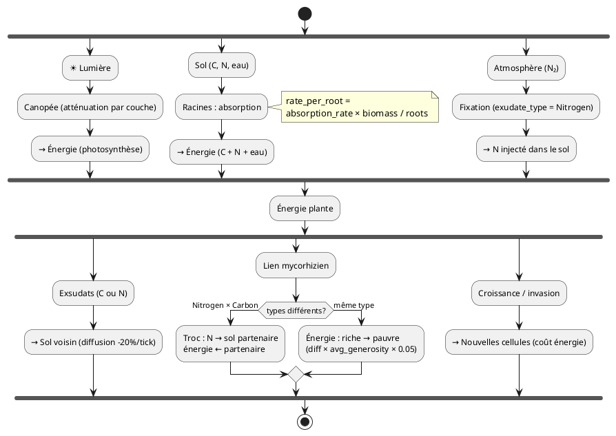

# Interactions entre Plantes

## Zones et compétition

Chaque plante a trois couches spatiales (voir 02-plants.md, 03-perception.md) :

- **Emprise au sol (footprint)** : cellules exclusives. Seule couche où l'invasion est possible.
- **Canopée (canopy)** : couche aérienne partagée. Ombre dynamique par priorité de taille.
- **Racines (roots)** : couche souterraine partagée. Absorption, exsudats, symbiose.

Quand les racines de deux plantes occupent les mêmes cellules, elles sont en **compétition passive** pour les ressources (carbone, azote, humidité). Pas besoin d'invasion — l'absorption est partagée, la plus efficace gagne.

## Absorption des nutriments

L'absorption est **proportionnelle à la biomasse** de la plante, répartie sur ses cellules de racines. Plus la plante est grosse, plus elle absorbe au total, mais moins par cellule (dilution).

### Formule

```
rate_per_root = absorption_rate × biomass / root_count
```

- `absorption_rate` : 0.03 (configurable via `SimConfig`)
- Pour chaque cellule de racine, la plante absorbe `min(ressource_disponible, rate_per_root)` de carbone, d'azote et d'eau.
- L'énergie gagnée = somme de tout ce qui est absorbé (C + N + eau).

### Exemples concrets

| Plante | Biomasse | Racines | Rate/racine | Absorption totale max |
|---|---|---|---|---|
| Petite | 1 | 1 | 0.03 × 1 / 1 = **0.03** | 0.03 |
| Grande | 10 | 20 | 0.03 × 10 / 20 = **0.015** | 0.30 |

**Effet émergent :** une grande plante absorbe 10× plus au total mais 2× moins par cellule. Elle épuise le sol sur une large zone plutôt que de creuser un puits local profond.



## Exsudats racinaires (coopération publique)

Chaque plante peut injecter des ressources dans le sol autour de ses racines via l'output `exudate_rate`. Le **type exsudé** (carbone ou azote) est un **trait génétique** (`exudate_type`), pas une décision par tick. Les fixatrices d'azote émergent par évolution.

| Aspect | Détail |
|---|---|
| Mécanisme | La plante injecte exudate_rate × exudate_output_rate (0.02 par défaut) de carbone OU d'azote (selon `exudate_type`) par tick dans les cellules racinaires. Les taux exacts sont configurables via `SimConfig`. |
| Coût | Énergie : exudate_rate × exudate_energy_cost_rate (0.015 par défaut) /tick |
| Diffusion | Les exsudats diffusent aux cellules adjacentes, décroissent de 20%/tick |
| Bénéficiaires | Toute plante dont la zone d'influence chevauche les cellules enrichies |
| Visuel | Halo doré/ambré semi-transparent autour des racines émettrices |

### Fixation atmosphérique d'azote

Les plantes avec `exudate_type = Nitrogen` fixent de l'azote via une conversion **carbone → azote** (modélisant les bactéries fixatrices associées aux légumineuses). La fixation dépend de la lumière et du carbone disponible : `fixation = avg_light × avg_carbon × nitrogen_fixation_rate` (0.03). Le coût est en **carbone du sol** (30 % du montant fixé), pas en énergie. La fixatrice **garde l'azote pour elle** — il n'est pas injecté dans le sol. L'azote n'arrive dans le sol que par décomposition (à sa mort) ou par échange via lien mycorhizien (troc N contre énergie).

**Ce qui émerge :** une fixatrice d'azote pousse là où les autres ne peuvent pas (sol sans N). Son avantage compétitif vient du **commerce** : elle vend du N via symbiose en échange d'énergie. À l'inverse, un parasite (exudate 0 mais absorption forte) crée un puits — gradient négatif autour de lui.

## Connexion mycorhizienne (coopération privée)

Quand les **racines** de deux plantes occupent une même cellule, elles peuvent former un **lien direct** — modélisant le réseau de champignons mycorhiziens.

1. **Racines partagées** : les racines de A et B occupent au moins une cellule commune.
2. **Accord mutuel** : `connect_signal > 0.5` des deux côtés.
3. **Lien établi** : filament doré visible entre les deux plantes.
4. **Échange selon les types** : le comportement dépend de la combinaison d'`exudate_type` des deux plantes :
   - **Nitrogen × Carbon (troc asymétrique)** : la fixatrice donne de l'azote (injecté dans le sol sous les racines du partenaire), et reçoit de l'énergie en paiement. Montant N = `avg_generosity × transfer_rate × 5.0`. Paiement énergie = `N × 10.0`, plafonné à 10% de l'énergie du payeur.
   - **Même type (échange d'énergie)** : transfert d'énergie du riche vers le pauvre, basé sur la **différence d'énergie**. Montant = `(energy_a - energy_b) × avg_generosity × 0.05`. Seuil minimum de 0.1 pour déclencher le transfert.
5. **Taux de transfert** : `transfer_rate = avg_generosity × 0.02`, où `avg_generosity = (generosity_A + generosity_B) / 2`.
6. **Rupture** : si les racines ne partagent plus de cellule, ou si une plante envahit la zone de place de l'autre.

### Parasitisme mycorhizien

Une plante peut avoir `connect_signal > 0.5` (accepter le lien) mais `connect_generosity ≈ 0` (ne rien donner en retour). Avec une générosité proche de zéro, le `transfer_rate` chute (puisqu'il dépend de la moyenne des deux générosités) — le parasitisme pur est donc atténué par le mécanisme lui-même.

Avec le troc N↔énergie, le parasitisme est plus nuancé : une fixatrice d'azote peut donner beaucoup d'azote et recevoir de l'énergie en retour, créant une asymétrie fonctionnelle qui n'est pas du parasitisme mais de la spécialisation.

## Invasion = croissance agressive

Il n'y a pas de « mode invasion ». L'invasion est le résultat de la **croissance dans la zone de place d'un autre**. Quand une plante essaie d'ajouter une cellule et que cette cellule appartient à la zone de place d'un voisin plus faible, elle la prend.

| Condition | Détail |
|---|---|
| Déclenchement | La plante pousse en emprise au sol (`canopy_vs_roots` entre 0.33 et 0.66, `grow_intensity > 0`) et la cellule cible est dans la zone de place d'une autre plante |
| Réussite | Si énergie attaquant > énergie défenseur + 10 |
| Défense | Si `defense > 0.5` chez le défenseur : le seuil passe à +20 au lieu de +10. Coûte 3 énergie/tick. |
| Graines | Si la victime est une **graine** : invasion automatique et gratuite. La graine meurt sans condition d'énergie. |
| Coût | 12 énergie (au lieu de 5 pour une cellule libre) |
| Rupture symbiose | Si A envahit la zone de place de B, tout lien mycorhizien entre A et B est rompu |
| Perte pour la victime | -3 vitalité + perte de la cellule. Si 0 cellules : mort. |

## Équilibre écosystémique

| Stratégie | Forces | Faiblesses |
|---|---|---|
| Invasion pure | Gains rapides en territoire | Épuisement (énergie), sol détruit, isolée |
| Fixatrice d'azote | Attire les voisins, indispensable à l'écosystème | Coût énergétique des exsudats |
| Exsudats carbone | Enrichit le sol, favorise la décomposition rapide | Profite aussi aux parasites |
| Connexion symbiotique N↔énergie | Spécialisation efficace, résilience collective | Dépendance au partenaire |
| Parasitisme mycorhizien | Ressources gratuites à court terme | Atténué par avg_generosity, la victime meurt → plus de source |
| Défense pure | Résiste aux invasions | Coût énergétique permanent, pas de croissance |
| **Mixte (adaptée)** | **Flexible, durable** | **Plus complexe à évoluer** |

## Synthèse : flux de ressources


