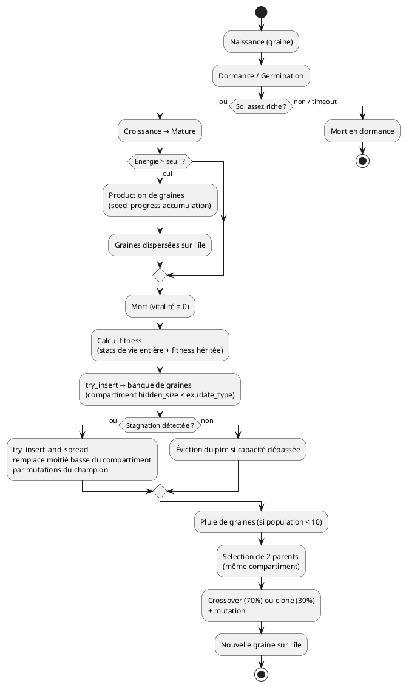

# Moteur de Neuroévolution

## Modèle : simulation continue

Pas de vagues ni de cycles artificiels. La simulation tourne en continu. L'évolution se fait "in vivo" : les plantes naissent, vivent, se reproduisent et meurent. La sélection naturelle est directe — tu survis ou pas.

## Banque de graines

La banque de graines est le réservoir génétique de la simulation. Elle est **compartimentée par (`hidden_size`, `exudate_type`)** : chaque combinaison forme un compartiment indépendant, ce qui maintient la diversité génétique. Capacité totale : **100 slots**.

### Initialisation
- Au démarrage, la banque est remplie avec **100 génomes aléatoires** avec un biais de survie minimal : les biais de `grow_intensity` et `connect_signal` sont positifs (la plante pousse et accepte les connexions par défaut), ce qui garantit un comportement minimal viable.
- L'île est peuplée avec **50 plantes** depuis cette banque initiale.

### Alimentation
- **À la mort de chaque plante**, sa fitness est évaluée (voir ci-dessous).
- Le génome est inséré dans son compartiment via `try_insert`. Si la capacité totale est dépassée, le pire génome du compartiment le plus peuplé est évincé.
- La banque maintient toujours un maximum de 100 slots répartis entre les compartiments.

### Anti-stagnation : `try_insert_and_spread`

Mécanisme optionnel pour casser la stagnation génétique dans un compartiment. Quand un génome performant est inséré via `try_insert_and_spread` :

1. Le génome est ajouté à son compartiment.
2. Le compartiment est trié par fitness décroissante.
3. La **moitié basse** (les pires génomes) est remplacée par des **mutations du nouveau génome**, avec une fitness initiale de 80 % de l'original.
4. Si la capacité totale est dépassée, le pire du compartiment le plus peuplé est évincé.

Ce mécanisme permet à un génome champion de "coloniser" son compartiment, accélérant la convergence locale tout en préservant la diversité inter-compartiments. Il est défini dans `evolution.rs` et disponible pour être activé en cas de stagnation détectée.

### Injection — pluie de graines
- La banque injecte des graines sur l'île quand la population germée tombe **sous 10 plantes**, à un taux configurable (`seed_rain_interval`).
- 10 % du temps : génome frais (totalement aléatoire). 90 % du temps : depuis la banque.
- Chaque graine issue de la banque est produite par **crossover + mutation** :
  1. Un compartiment est tiré aléatoirement (pondéré par sa taille).
  2. Deux parents sont tirés **dans le même compartiment** (donc même `hidden_size` et même `exudate_type`).
  3. Avec probabilité 0.7 → crossover uniforme des poids + crossover des traits + mutation.
  4. Avec probabilité 0.3 → clone du **meilleur parent en fitness** + mutation.
- Placement : 80 % près d'une plante existante (3-8 cellules), 20 % aléatoire sur l'île.
- Ce mécanisme garantit que la simulation ne s'éteint jamais.

## Deux voies de reproduction

| Voie | Source | Crossover | Mutation | Placement |
|---|---|---|---|---|
| **Reproduction vivante** | Plante mère (état Mature, stade autorisant la reproduction, énergie > 15.0) | Non — 90 % muté, 10 % clone exact | Oui (90 %) ou non (10 %) | Gradient : 70 % à 1-3 cellules, 20 % à 3-6, 10 % à 6-15 |
| **Banque de graines** | 2 génomes tirés du même compartiment | Oui (probabilité 0.7) | Oui (toujours) | 80 % près d'une plante existante, 20 % aléatoire |

### Production de graines (reproduction vivante)

La reproduction n'est pas binaire : elle fonctionne par **accumulation progressive** (`seed_progress`).

1. La plante doit être **Mature** et dans un **stade qui autorise la reproduction** (`can_reproduce`).
2. L'énergie doit être supérieure au seuil (`seed_energy_threshold`, défaut **15.0**).
3. À chaque tick, `seed_progress += biomasse × seed_production_rate` (défaut **0.01**).
4. Quand `seed_progress >= 1.0`, une graine est produite et coûte `seed_energy_cost` (défaut **5.0**) en énergie.
5. La production continue tant que l'énergie reste au-dessus du seuil.

### Fitness héritée

Chaque graine hérite de **30 % de la fitness estimée de son parent** au moment de la reproduction. Cette fitness héritée s'ajoute à la fitness propre de la plante à sa mort, créant un effet de lignée : les descendants de plantes performantes démarrent avec un bonus.

Les deux voies coexistent : la reproduction vivante assure la continuité locale (les bonnes stratégies se propagent dans leur voisinage), la banque assure le brassage global et la résilience.

## Cycle évolutif

## Mutations

Les mutations s'appliquent à la création de la graine (reproduction vivante : 90 % des cas ; banque : toujours).

| Trait | Type de mutation | Paramètres |
|---|---|---|
| Poids du réseau | Gaussien | Probabilité 0.3, amplitude σ = 0.2 |
| carbon_nitrogen_ratio | Gaussien | Probabilité 0.3, σ = 0.05, clampé [0.3, 0.9] |
| max_size | Gaussien | Probabilité 0.1, σ = 2, clampé [15, 40] |
| exudate_type | Flip | Probabilité 0.01 |
| hidden_size | ±1 | Probabilité 0.05. Resize du réseau (neurones ajoutés initialisés à 0, ou supprimés). |

## Fonction de fitness

La fitness est calculée **à la mort de chaque plante**, sur la base de sa vie entière. La **reproduction est le facteur dominant** : une plante qui se reproduit beaucoup est massivement favorisée. La coopération (symbiose, échanges C/N) reste importante car elle aide à survivre plus longtemps → plus de reproductions.

| Composante | Poids | Ordre de grandeur typique |
|---|---|---|
| Biomasse max atteinte | × 0.5 | ~10 |
| Durée de vie (ticks) | × 0.01 | ~5 |
| Territoire max contrôlé | × 0.3 | ~3 |
| Connexions symbiotiques (cumul) | × 100.0 | ~300 |
| Exsudats émis (cumul) | × 50.0 | ~100 |
| Échanges C↔N via liens (cumul) | × 500.0 | ~500 |
| **Graines produites (cumul)** | **× 500.0** | **~2 000** (facteur dominant) |
| Sol enrichi (décomposition) | × 10.0 | ~30 |
| Sol épuisé sous soi (cumul) | × -1.0 | ~-1 |
| Monoculture autour de soi | × -5.0 | ~-3 |
| **Fitness héritée du parent** | +30 % de la fitness estimée du parent | variable |

**Formule** : `fitness = own_fitness + inherited_fitness`, plancher à 0.

**La pénalité monoculture** : un sol dominé par une seule espèce s'appauvrit naturellement (diversité du sol), et la fitness pénalise les plantes qui contribuent à cette monoculture. L'évolution favorise la coexistence.

## Compteur de génération

Le numéro de génération est un **index global** qui s'incrémente de 1 à chaque graine plantée (reproduction vivante ou injection depuis la banque). C'est une mesure du temps évolutif, pas un cycle artificiel.

## Spéciation émergente

La spéciation n'est pas programmée — elle émerge de la compartimentalisation de la banque de graines. Les cerveaux de même `hidden_size` et même `exudate_type` se croisent entre eux, formant des clusters. Combiné avec les traits génétiques (`carbon_nitrogen_ratio`, `max_size`), des **espèces fonctionnelles** apparaissent naturellement :

- Fixatrices d'azote à petit cerveau (coopératrices simples)
- Arbres à grand cerveau (stratégies complexes, lentes à émerger)
- Herbes rapides (petit max_size, convergence rapide)
- Parasites (generosity ~ 0, exploitation des liens)

## Paramètres configurables

| Paramètre | Valeur par défaut | Description |
|---|---|---|
| seed_bank_capacity | 100 | Nombre total de slots dans la banque (compartimentée) |
| seed_rain_interval | 45 ticks | Fréquence d'injection depuis la banque (si population < 10) |
| initial_population | 50 | Nombre de graines plantées au démarrage |
| seed_energy_threshold | 15.0 | Énergie minimale pour produire des graines |
| seed_energy_cost | 5.0 | Coût en énergie par graine produite |
| seed_production_rate | 0.01 | Taux d'accumulation de seed_progress par tick (× biomasse) |
| crossover_rate | 0.7 | Probabilité de crossover (vs clone) dans la banque |
