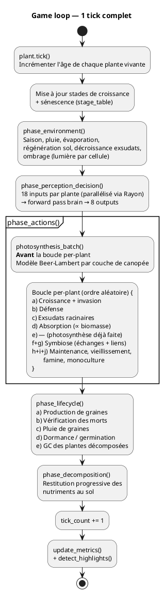

# Boucle de Simulation

## Modèle continu

La simulation tourne en continu. Il n'y a pas de "fin de partie" ni de cycle par vagues. L'île vit, les plantes naissent, poussent, meurent, et la banque de graines alimente en continu la population.

## Game loop (1 tick)

Séquence exacte de `run_tick()` dans `sim.rs` :



### Phase 0 — Âge et stades

1. **Âge** : incrémenter l'âge de chaque plante vivante (`plant.tick()`).
2. **Stades de croissance** : calculer le stade max atteignable par le génome (`max_stage_for_size`), puis le stade courant en fonction de la biomasse (`stage_for_biomass`). Émet `StageReached` si le stade change.
3. **Sénescence** : si le stade courant >= `start_stage` de sénescence, incrémenter le compteur `ticks_at_advanced_stage`.

### Phase 1 — Environnement (`phase_environment`)

1. **Saison** : avancer le cycle saisonnier (`season_cycle.advance()`). 4 saisons de 360 ticks chacune (1 an = 1440 ticks).
2. **Pluie** : ajouter de l'humidité sur les cellules terrestres (`rain_rate` = 0.01, modulé par la saison).
3. **Évaporation** : réduire l'humidité. Sous canopée : `evaporation_canopy_rate` = 0.002. À découvert : `evaporation_rate` = 0.005.
4. **Régénération sol** : le carbone et l'azote se régénèrent lentement, plafonnés aux seuils naturels (C < 0.3, N < 0.05). Taux : `carbon_regen_rate` = 0.0005, `nitrogen_regen_rate` = 0.00005. L'azote est quasi absent sans fixatrices.
5. **Décroissance exsudats** : `exudates *= exudate_decay` (0.8).
6. **Ombrage** : recalculer la lumière par cellule. Mer = 0. Sous canopée = `canopy_light` (0.2) x modificateur saisonnier. Plein soleil = modificateur saisonnier.

### Phase 2 — Perception et décision (`phase_perception_decision`)

7. **Pour chaque plante vivante non-graine** : calculer les 18 inputs (4 état interne + 4 sol local + 10 gradients).
8. **Forward pass** du réseau de neurones -> 8 outputs.
9. Calcul parallélisé via **Rayon** (lecture seule sur le World).

### Phase 3 — Actions (`phase_actions`)

#### Photosynthèse batch (avant la boucle per-plant)

`photosynthesis_batch()` tourne **avant** la boucle per-plant. C'est un modèle Beer-Lambert par couche de canopée :

```plantuml
@startuml
title Photosynthèse batch — modèle Beer-Lambert
start

:Construire canopy_map
cellule → [(plant_idx, footprint_size)]
Exclure plantes mortes et stades
sans photosynthèse;

:Pour chaque cellule de canopy_map;

:Trier les occupants par
footprint_size décroissant
(plus grande plante en premier);

:remaining = lumière de la cellule (base_light);

while (occupants restants ?) is (oui)
  :gain[plant_idx] +=
  remaining × photosynthesis_rate (0.08);
  :remaining *= transmittance
  canopy_light (0.2);
endwhile (non)

:Appliquer gains d'énergie
à chaque plante;

stop
@enduml
```

La plus grande plante (par taille de footprint) capte la lumière pleine sur chaque cellule de canopée. Chaque couche en dessous ne reçoit que la lumière transmise (`canopy_light` = 0.2, soit 80% absorbée par couche). Les gains s'accumulent sur toutes les cellules de canopée de la plante.

**Valeurs clés** : `photosynthesis_rate` = 0.08, `canopy_light` (transmittance) = 0.2.

#### Boucle per-plant (ordre aléatoire, Fisher-Yates)

Pour chaque plante vivante non-graine, dans un ordre aléatoire :

10. **Croissance + invasion** : résoudre `grow_dir`, `grow_intensity`, `canopy_vs_roots`. Le brain choisit entre canopée (> 0.66), emprise au sol (0.33-0.66), ou racines (< 0.33). Mode upgrade ([0.1, 0.5)) ou extend ([0.5, 1.0]). Si la cellule cible est dans l'emprise d'une autre plante, tentative d'invasion.
11. **Défense** : coût de `defense_energy_cost` (3.0) énergie/tick si `defense > 0.5`.
12. **Exsudats racinaires** : injecter carbone ou azote (selon `exudate_type`) dans le sol des cellules racinaires. Les fixatrices d'azote bénéficient d'une fixation atmosphérique automatique.
13. **Absorption** : proportionnelle à la biomasse, répartie sur les racines. Formule par cellule de racine : `absorption_rate x biomasse / nb_racines`. Exemple : petite plante (bio=1, 1 racine) = 0.03/racine (total 0.03). Grande plante (bio=10, 20 racines) = 0.015/racine (total 0.30). L'absorption totale croît avec la biomasse, mais l'extraction par cellule diminue (dilution).
14. **Symbiose** : échanges C/N entre plantes connectées + création de nouveaux liens mycorhiziens.
15. **Maintenance** : coûts proportionnels à la biomasse (`maintenance_rate` = 0.02), vieillissement (`aging_base_rate` = 0.5), famine (si énergie < `starvation_threshold` = 0.1, drain vitalité à `starvation_drain_rate` = 3.0), pénalité monoculture.

### Phase 4 — Vie et mort (`phase_lifecycle`)

16. **Production de graines** : les plantes matures avec assez d'énergie (> `seed_energy_threshold` = 15.0) accumulent `seed_progress` au rythme de `biomasse x seed_production_rate` (0.01) par tick. Quand `seed_progress >= 1.0`, une graine est produite. Coût : `seed_energy_cost` = 5.0. **90% mutation, 10% clone exact** (pas de mutation). Dispersion par gradient de distance : 70% proche (1-3 cellules), 20% moyen (3-6), 10% loin (6-15).
17. **Vérification des morts** : vitalité = 0 -> mort. Démarrer la décomposition progressive (`decomposition_ticks` = 50). Évaluer la fitness. Si fitness > pire de la banque, remplacer dans la `SeedBank`.
18. **Pluie de graines** (tous les `seed_rain_interval` = 45 ticks) : uniquement si < 10 plantes germées. 10% graine fraîche (génome aléatoire), 90% depuis la banque. 80% placement près d'une plante existante (3-8 cellules), 20% position aléatoire.
19. **Dormance / germination** : les graines vérifient les conditions de germination (C > `germination_carbon_min` = 0.1, N > `germination_nitrogen_min` = 0.08). **Exemptions par spécialité** : les fixatrices d'azote (`exudate_type = Nitrogen`) n'ont pas besoin de N dans le sol, les capteurs de carbone (`exudate_type = Carbon`) n'ont pas besoin de C. Timeout de dormance : `dormancy_timeout` = 360 ticks.
20. **GC** : tous les 100 ticks, retirer les plantes entièrement décomposées.

### Phase 5 — Décomposition (`phase_decomposition`)

21. **Décomposition progressive** : les plantes en état `Decomposing` restituent carbone et azote au sol sous leur emprise, répartis sur `decomposition_ticks` (50) ticks.

### Phase 6 — Métriques

22. **Compteurs** : naissances/morts à partir des events du tick. Reset annuel au changement de saison Printemps.
23. **Métriques agrégées** : `update_metrics()` (population, lignées, historiques, fitness).
24. **Highlights** : `detect_highlights()` (moments clés pour le replay).

## Performance

### Estimation (Mac M-series, simulation continue)

| Composante | Coût par tick | Notes |
|---|---|---|
| Âge + stades (phase 0) | Léger | Itération sur les plantes. |
| Environnement (phase 1) | Léger | Parcours de grille. Ombrage = bitmap canopée. |
| Perception (phase 2) | Modéré | 18 inputs x nb plantes vivantes. Parallélisé via Rayon. |
| Actions (phase 3) | Modéré | Photosynthèse batch + boucle per-plant (croissance, absorption, symbiose). |
| Vie/mort (phase 4) | Léger | Itération sur les plantes, banque de graines. |
| Décomposition (phase 5) | Léger | Itération sur les plantes en décomposition. |
| Métriques (phase 6) | Léger | Agrégation et détection highlights. |

Avec ~20-50 plantes vivantes sur une grille 128x128 : **~1ms par tick** estimé. A 30 ticks/seconde = ~30ms/s de simulation. Large marge pour le rendu TUI ou l'accumulation rapide.

### Levier de parallélisme

- **Rayon** : la perception (phase 2) est parallélisée par plante (lecture seule sur la grille).
- La photosynthèse batch est séquentielle mais en O(cellules de canopée), pas O(grille).
