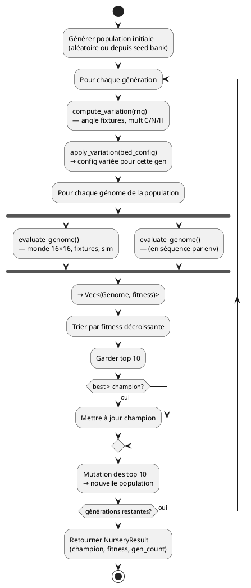

# Pépinière (Nursery)

La pépinière est un système d'évaluation de génomes **hors simulation principale**. Elle fait tourner chaque génome dans des environnements contrôlés (bacs isolés 16×16), mesure sa fitness, puis applique un cycle génétique classique (sélection, mutation, nouvelle génération) pour produire des génomes optimisés — les **champions**.

## Concept

Dans la simulation principale, l'évolution se fait "in vivo" : les plantes naissent, vivent et meurent sur l'île. La pépinière prend l'approche inverse : elle isole un génome dans un micro-monde contrôlé, lui fait vivre une simulation tronquée, et mesure sa performance. Cela permet d'évaluer rapidement des milliers de génomes sans les contraintes de la simulation complète.

Chaque environnement teste une **compétence spécifique** : survie en carence, cohabitation avec des voisins, résistance au froid, etc. Le résultat est une banque de graines (seed bank) contenant les meilleurs génomes par environnement.

## Modèle des bacs de test

### `BedConfig`

Chaque bac est défini par une `BedConfig` qui contrôle les conditions initiales du sol, la lumière, la durée de la simulation et les fixtures présentes.

| Paramètre | Type | Défaut | Description |
|---|---|---|---|
| `grid_size` | `u16` | 16 | Taille de la grille (carrée) |
| `initial_carbon` | `f32` | 0.5 | Carbone initial par cellule |
| `initial_nitrogen` | `f32` | 0.3 | Azote initial par cellule |
| `initial_humidity` | `f32` | 0.5 | Humidité initiale par cellule |
| `light_level` | `f32` | 0.8 | Niveau de lumière (0.0–1.0) |
| `max_ticks` | `u32` | 2000 | Durée maximale de la simulation |
| `carbon_regen_rate` | `f32` | 0.002 | Régénération carbone par tick |
| `nitrogen_regen_rate` | `f32` | 0.001 | Régénération azote par tick |
| `humidity_regen_rate` | `f32` | 0.01 | Régénération humidité par tick |
| `locked_season` | `Option<Season>` | `None` | Saison verrouillée (optionnel) |
| `fixtures` | `Vec<FixtureConfig>` | `[]` | Plantes artificielles présentes dans le bac |

### `FixtureBehavior`

Les fixtures sont des plantes artificielles déterministes (`FixturePlant`). Elles sont **immortelles**, de taille fixe, et ne se reproduisent pas. Leur rôle est de créer un contexte réaliste dans le bac.

| Comportement | Description | Paramètre |
|---|---|---|
| `Exuder` | Injecte une ressource (C ou N) dans le sol autour d'elle chaque tick | `rate: f32` |
| `Ombrager` | Réduit la lumière à 0.2 dans un rayon donné | `radius: u16` |
| `Envahir` | Plante agressive — reçoit de l'énergie supplémentaire (+50/tick) | — |
| `Inerte` | Juste présente, ne fait rien de spécial | — |

Les fixtures ont un footprint et des racines en étoile (pattern spirale jusqu'à rayon 2), dimensionnés par leur paramètre `biomass`. Les racines s'étendent plus loin que le footprint pour faciliter la symbiose.

## Les 10 environnements

Les environnements sont définis dans `nursery_environments()`. Chacun teste une facette différente de la survie.

| # | Nom | Ticks | C init | N init | H init | Lumière | Regen C | Regen N | Regen H | Fixtures | Saison |
|---|---|---|---|---|---|---|---|---|---|---|---|
| 1 | **Solo riche** | 5000 | 0.5 | 0.3 | 0.5 | 0.8 | 0.002 | 0.001 | 0.01 | — | — |
| 2 | **Carence N** | 3000 | 0.5 | 0.0 | 0.5 | 0.8 | 0.002 | 0.0 | 0.01 | — | — |
| 3 | **Carence C** | 3000 | 0.05 | 0.3 | 0.5 | 0.8 | 0.0 | 0.001 | 0.01 | — | — |
| 4 | **Avec fixatrice** | 5000 | 0.5 | 0.0 | 0.5 | 0.8 | 0.001 | 0.0 | 0.01 | 1 Exuder N (rate 0.05, pos 10,8) | — |
| 5 | **Avec arbre** | 5000 | 0.5 | 0.3 | 0.5 | 0.8 | 0.002 | 0.001 | 0.005 | 1 Ombrager (radius 4, biomass 8, pos 8,10) | — |
| 6 | **Hiver** | 3000 | 0.3 | 0.1 | 0.3 | 0.3 | 0.0005 | 0.0002 | 0.005 | — | Winter |
| 7 | **Sécheresse** | 3000 | 0.5 | 0.2 | 0.05 | 1.0 | 0.001 | 0.0005 | 0.0 | — | — |
| 8 | **Compétiteur** | 5000 | 0.5 | 0.3 | 0.5 | 0.8 | 0.002 | 0.001 | 0.01 | 1 Envahir (biomass 5, pos 10,8) | — |
| 9 | **Exsudation** | 5000 | 0.3 | 0.1 | 0.5 | 0.8 | 0.0 | 0.0 | 0.005 | 1 Exuder C (rate 0.03, pos 10,8) | — |
| 10 | **Mixte** | 3000 | 0.4 | 0.1 | 0.4 | 0.7 | 0.001 | 0.0 | 0.008 | 2 : Exuder N (rate 0.03, pos 10,8) + Envahir (biomass 4, pos 6,8) | — |

**Logique des environnements :**
- **Solo riche** : baseline — le génome doit simplement survivre et croître dans de bonnes conditions.
- **Carence N / Carence C** : tester l'adaptation à un nutriment manquant, sans régénération.
- **Avec fixatrice** : sol sans azote, mais une fixture exsude de l'azote à proximité — le génome doit s'en rapprocher.
- **Avec arbre** : une fixture crée une zone d'ombre massive — le génome doit pousser malgré la compétition pour la lumière.
- **Hiver** : conditions froides permanentes (saison verrouillée), ressources faibles, lumière basse.
- **Sécheresse** : humidité quasi nulle, pas de régénération — tester la résistance au stress hydrique.
- **Compétiteur** : une fixture agressive partage le bac — le génome doit survivre face à l'invasion.
- **Exsudation** : sol sans régénération naturelle, seule source de carbone = la fixture qui exsude.
- **Mixte** : cumul de pressions — un exsudeur N et un envahisseur, sol pauvre, lumière réduite.

## Évaluation d'un génome

La fonction `evaluate_genome()` évalue un seul génome dans un bac isolé.

### Étapes

1. **Création du monde** : grille `grid_size × grid_size`, sol uniforme (C, N, H, lumière selon la config), île plate (tout est terre, altitude 0.5).
2. **Placement du génome** : une `Plant` est créée au centre de la grille (position `grid_size/2, grid_size/2`) avec l'ID 1.
3. **Placement des fixtures** : les `FixturePlant` sont placées aux positions définies dans la config, avec des IDs à partir de 100.
4. **Construction du SimState** : config dérivée de `BedConfig`, mode nursery activé (`nursery_mode: true`), pas de pluie de graines (`seed_rain_interval: MAX`), seed bank minimale (capacité 1).
5. **Boucle de simulation** : jusqu'à `max_ticks` ou mort de la plante :
   - `tick()` sur chaque plante vivante
   - `phase_environment()` (pluie, ombrage, décomposition)
   - `apply_fixtures()` (keepalive des fixtures + effets comportementaux)
   - `phase_perception_decision()` (calcul des 18 inputs, forward pass du brain)
   - `phase_actions()` (croissance, invasion, défense, symbiose)
   - `phase_lifecycle()` (reproduction, germination, GC)
   - Pas de `phase_decomposition` — arrêt net à la mort.
6. **Calcul fitness** : `evaluate_fitness()` sur les `PlantStats` accumulées pendant la simulation.

### Saison verrouillée

Si `locked_season` est définie, `ticks_per_season` est mis à `max_ticks + 1` (la saison ne change jamais). Le tick de départ est calculé pour que la saison soit immédiatement active : Spring = 0, Summer = tps, Autumn = 2×tps, Winter = 3×tps.

## Variation inter-génération

Pour éviter le **surapprentissage** (un génome qui mémorise une configuration spatiale exacte au lieu d'apprendre une stratégie générale), chaque génération voit un scénario légèrement différent.

### `GenVariation`

À chaque génération, 4 valeurs aléatoires sont tirées du RNG pour produire une variation :

| Paramètre | Formule | Plage |
|---|---|---|
| `fixture_angle` | `rng.next_f32() × 2π` | [0, 2π) radians |
| `carbon_mult` | `0.8 + rng.next_f32() × 0.4` | [0.8, 1.2] |
| `nitrogen_mult` | `0.8 + rng.next_f32() × 0.4` | [0.8, 1.2] |
| `humidity_mult` | `0.8 + rng.next_f32() × 0.4` | [0.8, 1.2] |

### `apply_variation`

La variation est appliquée sur une copie de la `BedConfig` :

- **Rotation des fixtures** : chaque fixture tourne autour du centre de la grille de `fixture_angle` radians. La distance au centre est conservée (rotation pure), avec arrondi entier et clampage aux bords de la grille.
- **Multiplicateurs sol** : les taux initiaux (`initial_carbon`, `initial_nitrogen`, `initial_humidity`) sont multipliés par leur facteur respectif.

Tous les génomes d'une même génération voient le **même scénario** (même variation). Seule la variation change entre générations.

## Cycle génétique complet

La fonction `run_nursery_env()` orchestre le cycle génétique pour un environnement donné.

### 1. Population initiale

- Si des génomes initiaux sont fournis (`initial_genomes`), ils sont utilisés comme base. La population est complétée par mutation des parents fournis.
- Sinon, `population` génomes aléatoires sont produits via `SeedBank::produce_fresh_seed()`.

### 2. Boucle générationnelle (×`generations`)

Pour chaque génération :
1. **Variation** : `compute_variation(rng)` produit le scénario de la génération.
2. **Évaluation** : chaque génome est évalué dans le bac varié via `evaluate_genome()`.
3. **Tri** : les génomes sont triés par fitness décroissante.
4. **Mise à jour du champion** : si le meilleur de la génération bat le record global, il devient le nouveau champion.
5. **Sélection** : les **top 10** génomes (ou moins si population < 10) sont conservés.
6. **Reproduction** : chaque parent produit `population / top.len()` enfants par mutation (`mutate_genome`). Le reste est complété par mutation du meilleur.

### 3. Résultat

Un `NurseryResult` est retourné avec le champion global, sa fitness et le nombre de générations exécutées.

### Parallélisation

`run_nursery_all()` (dans `infra/nursery.rs`) lance tous les environnements **en parallèle** via Rayon. Chaque environnement reçoit un seed distinct (`seed + index`) pour la reproductibilité.



## Persistance

La couche infra (`infra/nursery.rs`) gère toute la persistance de la pépinière.

### Export seed bank

`export_seed_bank()` produit un fichier JSON unique contenant tous les champions avec leurs métadonnées :

```json
{
  "version": 1,
  "created_at": "1234567890s",
  "champions": [
    {
      "env_name": "Solo riche",
      "fitness": 42.5,
      "generations_run": 50,
      "genome": { "..." }
    }
  ]
}
```

### Chargement seed bank

`load_seed_bank()` lit le fichier JSON et extrait les génomes valides. Erreur si aucun génome n'est valide.

### Sauvegarde intermédiaire

`save_generation()` sauvegarde les top génomes d'une génération dans un fichier `{env_name}/gen_{NNNN}.json`, permettant de reprendre un entraînement ou d'analyser l'évolution.

### Export champions

`export_champions()` exporte un fichier JSON par champion (un par environnement) dans un dossier donné.

### Chargement depuis YAML

Les environnements peuvent aussi être définis dans un fichier YAML (`configs/nursery/environments.yaml`) chargé par `load_nursery_environments()`. Le format YAML supporte les mêmes paramètres que `BedConfig` avec en plus le tag `locked_season` et les fixtures typées (`Exuder`, `Ombrager`, `Envahir`, `Inerte`).

## Fichiers source

| Fichier | Responsabilité |
|---|---|
| `garden-core/src/application/nursery.rs` | Config, évaluation, variation, cycle génétique, 10 environnements |
| `garden-core/src/domain/fixture.rs` | `FixturePlant` — plante artificielle déterministe (immortelle, taille fixe) |
| `garden-core/src/infra/nursery.rs` | Parallélisation (Rayon), persistance JSON/YAML, seed bank |
| `garden-cli/src/nursery_runner.rs` | Thread nursery + `NurseryControls` (pause/quit) |
| `garden-cli/src/nursery_snapshot.rs` | `NurserySnapshot` — pont entre thread nursery et TUI |
