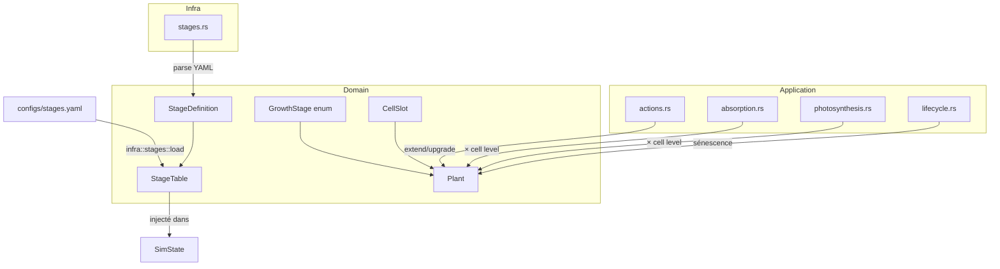

# feat: Growth Stages — stades de croissance émergents du génome

## Overview

Refactorer le cycle de vie des plantes en 9 stades de croissance (Graine → Vénérable), avec un système de niveaux par case racine/canopée, des bonus/coûts par stade, et une sénescence par vulnérabilité croissante. Les "espèces" émergent du génome via `max_size` — pas d'espèces codées en dur. Le Vénérable est une keystone species (hub mycorhizien + enrichissement sol).

(see origin: `docs/brainstorms/2026-03-24-growth-stages-requirements.md`)

## Problem Statement

Les plantes ont un cycle de vie plat. Pas de diversité morphologique : un trèfle et un chêne sont la même entité avec des paramètres différents. L'écosystème a besoin de niches écologiques distinctes avec succession naturelle : pionniers → stabilisateurs → dominants → keystone.

## Proposed Solution

### Architecture des changements

```
domain/
├── plant.rs       ← GrowthStage enum, CellSlot (Pos + level), stage transitions
├── stages.rs      ← NEW: StageDefinition, StageTable (pur domain, zéro dep)
├── symbiosis.rs   ← bonus hub mycorhizien vénérable
├── events.rs      ← nouveaux events (StageReached, CellUpgraded, VenerableDied)
├── traits.rs      ← PlantSpatial étendu (cell levels)
├── fixture.rs     ← support des niveaux de cases
application/
├── actions.rs     ← refonte grow (extend vs upgrade), bonus par stade
├── absorption.rs  ← absorption pondérée par niveau de case
├── photosynthesis.rs ← photosynthèse pondérée par niveau de case
├── lifecycle.rs   ← sénescence, mort vénérable, enrichissement sol
├── perception.rs  ← input stade normalisé pour le brain
├── nursery.rs     ← nouveaux environnements par niche
├── config.rs      ← SimConfig : référence vers StageTable
infra/
├── stages.rs      ← NEW: chargement YAML → StageTable
├── dto/plant.rs   ← sérialisation CellSlot, GrowthStage
configs/
├── stages.yaml    ← NEW: définitions des 9 stades
```

## Résolutions des questions techniques

Ces questions étaient déférées au planning dans l'origin doc. Voici les résolutions proposées.

### Q1. Définition de la biomasse

**Décision : biomasse = footprint.len() (inchangé).**

Les niveaux de cases sont une couche de capacité séparée. La biomasse reste le nombre de cases physiques au sol. Les seuils de stade de R3 sont définis en nombre de cases. Upgrader une case racine/canopée augmente sa capacité mais ne change pas la biomasse.

*Justification :* cohérent avec le brainstorm ("Germe = 1 racine + 1 tronc"), simple, pas de cascade sur les formules existantes.

### Q2. Encodage extend vs upgrade dans grow_intensity

**Décision : seuil sur grow_intensity.**

```
grow_intensity ∈ [0.0, 1.0]
├── [0.0, 0.1)  → pas de croissance (inchangé)
├── [0.1, 0.5)  → UPGRADE : améliore la case de plus bas niveau dans la couche choisie
└── [0.5, 1.0]  → EXTEND  : ajoute une nouvelle case dans la couche choisie (comportement actuel)
```

Output 3 (`canopy_vs_roots`) détermine la couche ciblée (inchangé : >0.66=canopy, 0.33-0.66=footprint, <0.33=roots).

**Fallbacks :**
- Upgrade demandé mais toutes les cases sont au niveau max → fallback vers extend
- Extend demandé mais pas de case adjacente libre → fallback vers upgrade
- Les deux impossibles → pas d'action (énergie conservée)

### Q3. Sélection de la case à upgrader

**Décision : case de plus bas niveau dans la couche choisie.**

En cas d'égalité, la première dans le Vec (déterministe). Simple, greedy, pas besoin d'un output supplémentaire du brain.

### Q4. Régression de stade

**Décision : pas de régression.** Le stade est un high-water mark. Une plante qui perd des cellules (invasion, stress) ne redescend pas de stade. Elle peut mourir mais pas régresser. Simplifie le modèle et évite les oscillations aux seuils.

*Conséquence :* les niveaux max de cases restent au niveau du stade atteint, même si la biomasse redescend sous le seuil.

### Q5. Caps de niveau par stade

Définis dans le YAML (voir schema ci-dessous). Valeurs de la grille du brainstorm.

### Q6. Coûts énergie extend vs upgrade

- **Extend** : formule actuelle (`base_cost * (existing_cells + 1) / 20.0`) — inchangée.
- **Upgrade** : `base_upgrade_cost * target_level` — coût croissant avec le niveau visé. `base_upgrade_cost` défini dans le YAML par stade.

### Q7. PlantState vs GrowthStage

**Décision : orthogonaux.** PlantState = état du cycle de vie (Seed/Growing/Stressed/Dying/Dead...). GrowthStage = catégorie de taille (Graine/Germe/.../Vénérable). Les deux coexistent. Un "Arbre" peut être "Stressed". Un "Germe" peut être "Dying".

Mapping naturel : `PlantState::Seed` ↔ `GrowthStage::Graine` (mais ce sont des axes différents).

### Q8. Courbe de capacité par niveau

**Décision : linéaire avec base 1.** Multiplicateur = `1 + level` (niveau 0 → ×1, niveau 1 → ×2, niveau 5 → ×6). Simple, prévisible, facile à calibrer. Niveau 0 donne une capacité de base (pas zéro). Si les tests montrent que c'est trop plat, on pourra passer en légèrement super-linéaire dans le YAML.

### Q9. Évaluation fitness nursery multi-niche

**Décision : fitness agrégée multi-environnement (existant) + nouveaux environnements par niche.** Chaque environnement a un poids dans le score final. Les environnements prairie favorisent naturellement les petites plantes (durée courte, sol pauvre → les grands meurent avant de progresser). Pas besoin de tracks séparées — la pression évolutive émerge des conditions.

### Q10. Dégradation keystone en sénescence

**Décision : bonus constant jusqu'à la mort.** Le vénérable est un hub puissant tant qu'il est vivant. La sénescence le rend vulnérable au stress, donc il finit par mourir — mais tant qu'il tient, il pompe. Ça crée des moments dramatiques : un écosystème qui dépend d'un vénérable fragile.

## Schema YAML — `configs/stages.yaml`

```yaml
# Définitions des 9 stades de croissance
# Chargé au démarrage, injecté dans SimState via StageTable

stages:
  - name: Graine
    biomass_min: 0
    biomass_max: 0
    cell_level_cap: 0
    maintenance_multiplier: 0.0
    can_photosynthesize: false
    can_reproduce: false
    can_symbiose: false
    bonuses: {}

  - name: Germe
    biomass_min: 1
    biomass_max: 1
    cell_level_cap: 0
    maintenance_multiplier: 0.2
    can_photosynthesize: false
    can_reproduce: false
    can_symbiose: false
    bonuses:
      invisibility: true  # pas ciblé par invasion

  - name: Pousse
    biomass_min: 2
    biomass_max: 3
    cell_level_cap: 1
    maintenance_multiplier: 0.5
    can_photosynthesize: true
    can_reproduce: false
    can_symbiose: false
    bonuses:
      growth_speed: 1.5  # croissance rapide

  - name: Plantule
    biomass_min: 4
    biomass_max: 6
    cell_level_cap: 1
    maintenance_multiplier: 0.7
    can_photosynthesize: true
    can_reproduce: false
    can_symbiose: true
    bonuses:
      resilience: 1.2  # résistance au stress

  - name: Arbuste
    biomass_min: 7
    biomass_max: 10
    cell_level_cap: 2
    maintenance_multiplier: 1.0
    can_photosynthesize: true
    can_reproduce: true
    can_symbiose: true
    bonuses:
      ground_cover: true  # couverture du sol

  - name: Jeune arbre
    biomass_min: 11
    biomass_max: 15
    cell_level_cap: 3
    maintenance_multiplier: 1.5
    can_photosynthesize: true
    can_reproduce: true
    can_symbiose: true
    bonuses:
      canopy_shade: true  # produit de l'ombre
      seed_distance: 1.5  # graines plus loin

  - name: Arbre
    biomass_min: 16
    biomass_max: 22
    cell_level_cap: 4
    maintenance_multiplier: 2.0
    can_photosynthesize: true
    can_reproduce: true
    can_symbiose: true
    bonuses:
      photosynthesis_multiplier: 1.5
      root_network: true  # réseau racinaire étendu

  - name: Arbre mature
    biomass_min: 23
    biomass_max: 30
    cell_level_cap: 5
    maintenance_multiplier: 2.5
    can_photosynthesize: true
    can_reproduce: true
    can_symbiose: true
    bonuses:
      reproduction_multiplier: 2.0
      symbiosis_hub: 1.5  # noeud symbiose

  - name: Vénérable
    biomass_min: 31
    biomass_max: 9999
    cell_level_cap: 5
    maintenance_multiplier: 3.0
    can_photosynthesize: true
    can_reproduce: true
    can_symbiose: true
    bonuses:
      symbiosis_hub: 3.0        # hub mycorhizien massif
      soil_enrichment: true      # enrichit le sol en N autour
      soil_enrichment_rate: 0.05 # N ajouté par tick par case racine
      resistance: 2.0            # résistance de base (compensée par sénescence)

# Coûts d'upgrade de case par niveau cible
upgrade_costs:
  base_cost: 3.0       # coût de base
  level_multiplier: 1.0 # coût = base_cost * target_level * level_multiplier

# Sénescence
senescence:
  start_stage: Arbre mature  # commence à ce stade
  vulnerability_rate: 0.002  # augmentation vulnérabilité par tick
  max_vulnerability: 0.5     # plafond (50% de résistance en moins)
```

## Prérequis technique : ajuster `max_size`

**Problème découvert à la recherche :** `GeneticTraits.max_size` est actuellement clampé à `[15, 40]` (`plant.rs`). Avec un minimum de 15, aucune plante ne peut rester petite — toutes peuvent atteindre au moins Jeune arbre (biomasse 11-15). Cela empêche l'émergence d'herbes, trèfles ou buissons.

**Solution :** abaisser la borne inférieure de `max_size` à **2** (permettant des plantes qui plafonnent à Pousse). La borne supérieure de 40 reste suffisante pour atteindre Vénérable (31+). Ce changement est fait en Phase 10a avec la migration domain.

## Précision : auto-évolution du tronc (R7)

Le tronc fait partie du footprint. L'auto-évolution au changement de stade signifie :
- **Visuellement (TUI/viewer)** : le tronc change d'apparence selon le stade (graine invisible, germe = point, pousse = tige, arbre = tronc épais, vénérable = tronc massif). C'est un changement de rendu, pas de mécanique.
- **Mécaniquement** : pas d'impact. Le footprint reste `Vec<Pos>` sans niveaux. Le stade lui-même porte l'information de "taille du tronc".

## Technical Approach

### Architecture

Le changement traverse toutes les couches DDD :



### Pattern d'injection (DDD)

Comme pour `Rng`, les définitions de stades sont des structs pures dans domain, parsées depuis YAML dans infra :

```
domain/stages.rs  → StageDefinition, StageTable (struct, pas de trait)
infra/stages.rs   → load_stages(path) -> StageTable (serde_yaml)
```

`StageTable` est passé par référence à `SimState` et aux fonctions d'application.

### Implementation Phases

#### Phase 10a: Domain — stades + niveaux

**Objectif :** poser les fondations dans le domain, sans casser l'existant.

**Fichiers touchés :**
- `domain/stages.rs` (NEW) — `GrowthStage` enum (9 variantes), `StageDefinition`, `StageTable`, `StageBonuses` (struct typée avec champs optionnels pour chaque bonus)
- `domain/plant.rs` — `CellSlot { pos: Pos, level: u8 }`, remplacement `Vec<Pos>` → `Vec<CellSlot>` pour canopy et roots. Footprint reste `Vec<Pos>` (pas de niveau, c'est le sol). Ajout `growth_stage: GrowthStage` sur Plant. Méthode `update_stage(&self, table: &StageTable)`. **Abaisser `max_size` clamp de [15, 40] à [2, 40]** pour permettre les petites espèces.
- `domain/traits.rs` — `PlantSpatial` : nouvelles méthodes `canopy_levels()`, `root_levels()`, `growth_stage()`
- `domain/fixture.rs` — `FixturePlant` : support `CellSlot` (level=0 par défaut)
- `domain/events.rs` — `StageReached { plant_id, stage }`, `CellUpgraded { plant_id, cell, layer, new_level }`

**Critère de done :** `cargo test` passe. Les tests unitaires vérifient : création CellSlot, transitions de stade, caps de niveau, pas de régression de stade.

**Blast radius :** plant.rs, traits.rs, fixture.rs + tous les fichiers qui itèrent sur `plant.canopy` ou `plant.roots` (absorption.rs, photosynthesis.rs, actions.rs, perception.rs, lifecycle.rs). Migration des `Vec<Pos>` → `Vec<CellSlot>` en une passe.

```rust
// domain/stages.rs — structure cible
#[derive(Debug, Clone, Copy, PartialEq, Eq, PartialOrd, Ord)]
pub enum GrowthStage {
    Graine,
    Germe,
    Pousse,
    Plantule,
    Arbuste,
    JeuneArbre,
    Arbre,
    ArbreMature,
    Venerable,
}

pub struct StageDefinition {
    pub name: GrowthStage,
    pub biomass_min: u16,
    pub biomass_max: u16,
    pub cell_level_cap: u8,
    pub maintenance_multiplier: f32,
    pub can_photosynthesize: bool,
    pub can_reproduce: bool,
    pub can_symbiose: bool,
    pub bonuses: StageBonuses,
}

pub struct StageTable {
    stages: Vec<StageDefinition>, // ordonné par GrowthStage
}

impl StageTable {
    pub fn stage_for_biomass(&self, biomass: u16, max_stage: GrowthStage) -> GrowthStage { .. }
    pub fn definition(&self, stage: GrowthStage) -> &StageDefinition { .. }
}

// domain/plant.rs — CellSlot
#[derive(Debug, Clone, Copy, PartialEq, Eq)]
pub struct CellSlot {
    pub pos: Pos,
    pub level: u8, // 0-5
}
```

#### Phase 10b: Application — mécaniques

**Objectif :** intégrer les stades dans toutes les mécaniques de simulation.

**Tâches :**

1. **actions.rs — refonte grow** :
   - Seuil grow_intensity : [0.1, 0.5) = upgrade, [0.5, 1.0] = extend
   - `try_upgrade_cell()` : sélectionne la case de plus bas niveau, vérifie cap, déduit énergie
   - `try_extend_cell()` : comportement actuel, crée CellSlot(pos, level=0)
   - Fallbacks bidirectionnels
   - Bonus de stade appliqués (growth_speed, seed_distance, etc.)

2. **absorption.rs — pondération par niveau** :
   - Formule : `base_absorption * (1 + cell.level) / root_count` par case racine
   - Cases niveau 0 = absorption minimale, niveau 5 = ×6

3. **photosynthesis.rs — pondération par niveau** :
   - Gain par case canopée : `remaining * photosynthesis_rate * (1 + cell.level)`
   - Cases de haut niveau captent plus de lumière

4. **lifecycle.rs — sénescence** :
   - Compteur `ticks_at_advanced_stage` sur Plant
   - Vulnérabilité = `min(ticks * vulnerability_rate, max_vulnerability)`
   - Appliquée comme réduction de résistance aux dégâts (sécheresse, invasion, hiver)
   - Mort vénérable → event `VenerableDied`, libération nutriments massive

5. **lifecycle.rs — enrichissement sol vénérable** :
   - Chaque tick, les racines du vénérable ajoutent N aux cases adjacentes du World
   - Taux défini dans YAML (soil_enrichment_rate)

6. **symbiosis.rs / actions.rs — hub mycorhizien** :
   - Multiplicateur sur les échanges C↔N quand un vénérable est impliqué dans le lien
   - Multiplicateur défini dans YAML (symbiosis_hub)

7. **perception.rs — input stade** :
   - Remplacer un input existant peu discriminant OU normaliser le stade dans un input existant
   - Option : `biomass_ratio` (input 2) encode déjà indirectement le stade. Peut suffire sans ajout.

8. **config.rs — intégration StageTable** :
   - `SimState` porte une référence vers `StageTable`
   - `StageTable` chargé depuis YAML dans infra, passé à la construction de SimState

**Critère de done :** `cargo test` passe. Tests d'intégration : une plante progresse de Graine à Arbre, les bonus s'appliquent, la sénescence réduit la résistance, un vénérable enrichit le sol.

#### Phase 10c: Nursery — niches

**Objectif :** forcer la pression évolutive pour produire des génomes de tailles variées.

**Nouveaux environnements (ajoutés au YAML existant `configs/nursery/environments.yaml`) :**

| Nom | Grid | Durée | Caractéristiques | Niche favorisée |
|-----|------|-------|-------------------|-----------------|
| Prairie sèche | 16×16 | 2000 | Sol pauvre, regen faible, pas de fixture | Pousse/Plantule (rapide, frugal) |
| Prairie fertile | 16×16 | 3000 | Sol moyen, regen moyenne, 2 fixtures herbe | Arbuste (reproduction) |
| Lisière | 16×16 | 4000 | Sol riche côté forêt, pauvre côté prairie | Jeune arbre/Arbuste |
| Forêt dense | 16×16 | 6000 | Sol très riche, fixture ombrageuse, regen forte | Arbre/Arbre mature |
| Vieux bois | 16×16 | 8000 | Sol extrêmement riche, fixture N-exudeuse, très long | Vénérable |

**Adaptation fitness :** les environnements courts favorisent naturellement les petites plantes (pas le temps de grandir). Les environnements longs avec sol riche favorisent les grandes. Pas besoin de modifier la formule de fitness — la pression émerge des conditions.

**FixturePlant :** les fixtures dans les nouveaux environnements peuvent avoir des stades (ex: fixture "arbre ombrageux" = stade Arbre avec canopy de haut niveau).

**Critère de done :** nursery headless produit des champions avec des `max_size` variés (certains stagnent à Pousse, d'autres montent à Arbre+). Vérifiable via `seeds/latest.json`.

#### Phase 10d: TUI — affichage stades

**Objectif :** visualisation immédiate du stade dans les panneaux existants.

**Changements :**
- **Panneau population** : afficher le stade à côté de chaque plante (icône ou abréviation : 🌱 Gr, 🌿 Po, 🌳 Ar, etc.)
- **Panneau évolution** : graphique de distribution des stades dans la population
- **Panneau logs** : events StageReached et VenerableDied
- **Snapshot** : inclure growth_stage dans le snapshot TUI

**Critère de done :** en mode TUI, on distingue visuellement les stades. La mort d'un vénérable est visible dans les logs.

#### Phase 10e: Calibrage

**Objectif :** ajuster les paramètres YAML pour obtenir la succession écologique.

**Méthode :**
1. Nursery headless : vérifier diversité des `max_size` dans les champions
2. Simulation libre : observer succession (pionniers → stabilisateurs → dominants → keystone)
3. Ajuster dans `configs/stages.yaml` : seuils, coûts, bonus, multiplicateurs
4. Vérifier : mort d'un vénérable → impact visible sur population locale
5. Itérer

**Critère de done :** les 5 success criteria de l'origin doc sont satisfaits.

## System-Wide Impact

### Interaction Graph

Transition de stade (biomasse atteint seuil) → `update_stage()` → émet `StageReached` event → débloque nouvelles capacités (reproduction, symbiose) → change les inputs du brain (biomass_ratio) → le brain adapte sa stratégie au tick suivant.

Mort vénérable → `VenerableDied` event → suppression enrichissement sol → chute N dans cases adjacentes → stress des plantes voisines → possible cascade de morts.

### Error Propagation

- YAML invalide au chargement → erreur au démarrage (fail fast), pas en runtime
- Stade incohérent (biomasse < seuil mais stage élevé après régression) → impossible par design (pas de régression)
- Cell level > cap → vérifié à l'upgrade, jamais créé

### State Lifecycle Risks

- **Migration seeds/latest.json** : les anciens génomes n'ont pas de stades. Solution : régénérer la seed bank avec la nursery mise à jour. Pas de migration, ré-entraînement.
- **Migration saves** : les sauvegardes JSON existantes n'ont pas de CellSlot. Solution : migration DTO (level=0 par défaut pour les cellules existantes).

### API Surface Parity

- `PlantSpatial` trait : toute implémentation (Plant, FixturePlant) doit supporter les nouvelles méthodes
- DTOs serde : `dto/plant.rs` doit refléter CellSlot et GrowthStage

## Acceptance Criteria

### Functional Requirements

- [ ] 9 stades séquentiels, seuils de biomasse configurables en YAML
- [ ] `max_size` du génome détermine le stade max atteignable
- [ ] Cases racine/canopée ont un niveau individuel (0-5), cap par stade
- [ ] Brain encode extend vs upgrade via grow_intensity (seuil 0.5)
- [ ] Tronc évolue automatiquement au changement de stade
- [ ] Bonus réels par stade (growth_speed, reproduction, shade, hub symbiose...)
- [ ] Coût maintenance croissant par stade
- [ ] Sénescence = vulnérabilité croissante aux stades avancés
- [ ] Vénérable = hub mycorhizien (×3 échanges) + enrichissement sol (N)
- [ ] Mort vénérable = event majeur avec impact écosystème
- [ ] Nursery : environnements par niche (prairie, lisière, forêt, vieux bois)
- [ ] Évolution produit des génomes avec max_size variés
- [ ] TUI affiche le stade de chaque plante

### Non-Functional Requirements

- [ ] Performance : <2ms/tick à 50 plantes (tolérance +100% vs actuel pour les niveaux)
- [ ] YAML chargé une fois au démarrage, pas de re-parse en runtime
- [ ] Zéro `unwrap()` dans le code de production
- [ ] `cargo clippy -- -D warnings` : zéro warning
- [ ] DDD respecté : domain/ sans dépendance externe

### Quality Gates

- [ ] Tests unitaires pour chaque stade, transition, cap de niveau
- [ ] Tests d'intégration : progression complète Graine → Vénérable
- [ ] Tests nursery : diversité max_size après 50 générations
- [ ] `cargo fmt` + `cargo clippy` propres

## Dependencies & Prerequisites

- Phase 9e (nursery calibrage) doit être stable — **OK, confirmé**
- `serde_yaml = "0.9"` déjà dans Cargo.toml — **OK**
- `configs/nursery/environments.yaml` existe déjà — **OK, on étend**

## Risk Analysis & Mitigation

| Risque | Impact | Mitigation |
|--------|--------|------------|
| `Vec<Pos>` → `Vec<CellSlot>` casse tout | Fort | Phase 10a fait la migration en une passe, tous les tests doivent passer avant 10b |
| Brain n'apprend pas extend vs upgrade | Moyen | Le seuil 0.5 est simple. Fallbacks bidirectionnels évitent les actions impossibles. Si le brain reste random, c'est OK au début — l'évolution sélectionnera |
| Sénescence tue les vénérables trop vite | Moyen | vulnerability_rate configurable dans YAML. Commencer très bas (0.001) et ajuster en 10e |
| Nursery ne produit pas de diversité max_size | Moyen | Environnements par niche forcent la pression. Si insuffisant, ajouter un bonus fitness "niche specialist" |
| Performance dégradée par per-cell lookups | Faible | Capacité linéaire (×level), pas de HashMap. Benchmark en 10e |
| Seeds existants incompatibles | Faible | Ré-entraînement nursery en 10c. Pas de migration, regeneration |

## Sources & References

### Origin

- **Origin document:** [docs/brainstorms/2026-03-24-growth-stages-requirements.md](docs/brainstorms/2026-03-24-growth-stages-requirements.md)
- Key decisions carried forward: émergence via max_size (pas d'espèces codées), niveaux par case avec upgrade brain, sénescence par vulnérabilité, vénérable = keystone (hub + sol), YAML pour les définitions

### Internal References

- Plant entity: `crates/garden-core/src/domain/plant.rs:252-270` (struct Plant, 3 couches)
- Brain outputs: `crates/garden-core/src/application/actions.rs:79-86` (8 outputs décodés)
- Growth mechanics: `crates/garden-core/src/application/actions.rs:134-411` (footprint/canopy/roots)
- Absorption: `crates/garden-core/src/application/absorption.rs` (formule proportionnelle biomasse)
- Photosynthesis: `crates/garden-core/src/application/photosynthesis.rs` (batch canopy attenuation)
- Symbiosis: `crates/garden-core/src/domain/symbiosis.rs` (SymbiosisNetwork, MycorrhizalLink)
- Nursery envs: `crates/garden-core/src/application/nursery.rs:358-545` (10 environments)
- Nursery YAML: `configs/nursery/environments.yaml` (format existant)
- Fitness: `crates/garden-core/src/application/evolution.rs:41-54` (seeds*500, symbiosis*100, CN*500)
- PlantEntity trait: `crates/garden-core/src/domain/traits.rs` (5 sub-traits)
- FixturePlant: `crates/garden-core/src/domain/fixture.rs` (implémente PlantEntity)
- Perception: `crates/garden-core/src/application/perception.rs` (18 inputs)
- Config TOML: `crates/garden-core/src/infra/config.rs` (chargement SimConfig)
- Planning doc: `docs/12-planning.md:217-233` (Phase 10 mentionnée)
